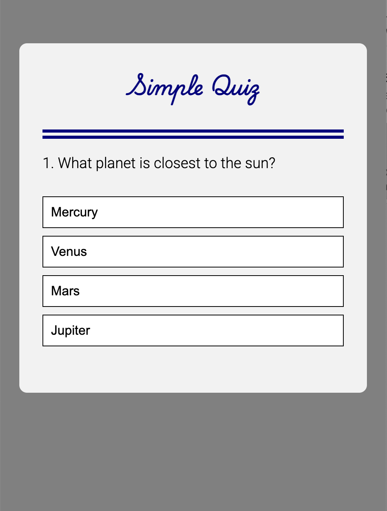

# Quiz App

A simple quiz application built using HTML, CSS, and JavaScript. The app allows users to test their knowledge on general questions, providing instant feedback with scores at the end. The application features an easy-to-use interface and can be customized with different questions and themes.

## Features

- Interactive quiz interface with multiple-choice questions.
- Instant feedback after selecting an answer.
- Score display at the end of the quiz.
- Customizable set of questions.
- Clean and responsive UI designed using CSS.

## Tech Stack

- **HTML**: Markup for the structure of the quiz.
- **CSS**: Styling and layout for the application, including responsiveness.
- **JavaScript**: Logic for handling the quiz functionality (e.g., tracking user answers, calculating score, moving between questions).

## How to Use

1. **Clone the repository**:
   ```bash
   git clone https://github.com/decencyokobia/Quiz-App.git
   ```
   
2. **Navigate to the project folder**:
   ```bash
   cd Quiz-App
   ```

3. **Open `index.html`** in your preferred web browser.

4. **Start the quiz**:
   - App loads once page is loaded.
   - Answer the questions by selecting the appropriate option.
   - The app will automatically show you the results at the end.

## Screenshot 


